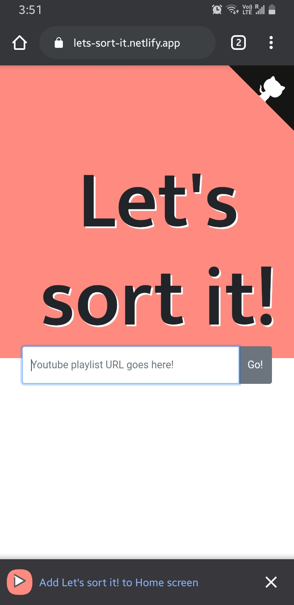
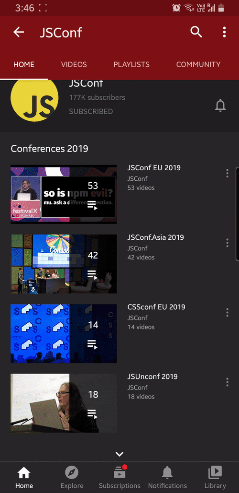
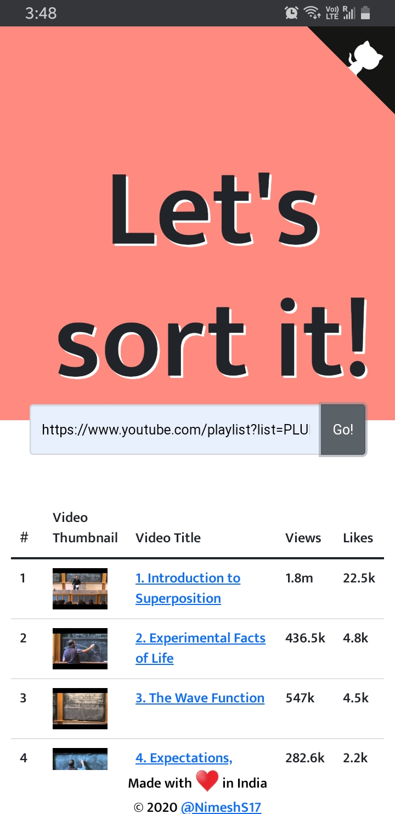

<h1 align="center"> <a href="https://youtuber-sorter.snimesh.com" target="_blank"> YouTube Playlist Sorter v2 </a> </h1>

 
<h3 align='center'>Give it a try once: <a href="https://youtuber-sorter.snimesh.com" target="_blank">https://youtuber-sorter.snimesh.com</a> </h3> 

## Inspired from [jaydp17/youtube-playlist-sorter](https://github.com/jaydp17/youtube-playlist-sorter)

### 🤔 What is [YouTube Playlist Sorter](https://youtuber-sorter.snimesh.com)?

A Web-app which sorts ↕️ a public playlist based on its popularity 🔥

### 💡 IDEA:

While watching the talks/videos of the tech-conferences, have you ever wondered that if you could sort the playlist based on its popularity?

So you can easily pickup that talk up and watch it right away.

There's no such feature on [Youtube](https://youtube.com/) as of now.

So I thought of building one, on my own.

### 🆕 What's new ?

Now no need to copy and paste youtube playlist URLs. `Just Share it and Sort it!`

It's a Progressive Web App ([PWA](https://web.dev/progressive-web-apps/)) which implements [Share Target API](https://web.dev/web-share-target/).

[Share Target API](https://web.dev/web-share-target/) helps in receving data from other application when the share button is clicked.

### For example:

While using YouTube mobile app, find the playlist you want to sort, click share 📤 and search for YouTube Playlist Sorter from the app list.

That's all!

It will automatically fill up the playlist URL and load the results for you!😎

### Demo

- Desktop Demo

- PWA Demo

  Please make sure that you've added the app to your Home Screen.
  Like this:

  

  Once added it to the `home screen`, Do as follows:

  

### Screenshots

- Desktop View

  

- Mobile View

  

## Special Thanks to [Jaydeep Solanki - Brain behind the idea](https://jaydp.com)

## ❤️ Credits

- [Node.js](https://nodejs.org/)
- [React.js](https://reactjs.org/)
- [Netlify](https://www.netlify.com/)
- [Workbox](https://developers.google.com/web/tools/workbox)
- [YouTube Data API v3](https://developers.google.com/youtube/v3)

## 🎓 License

[MIT](LICENSE)
