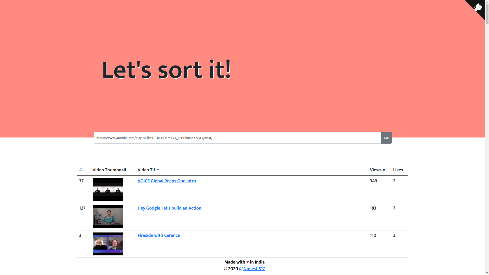
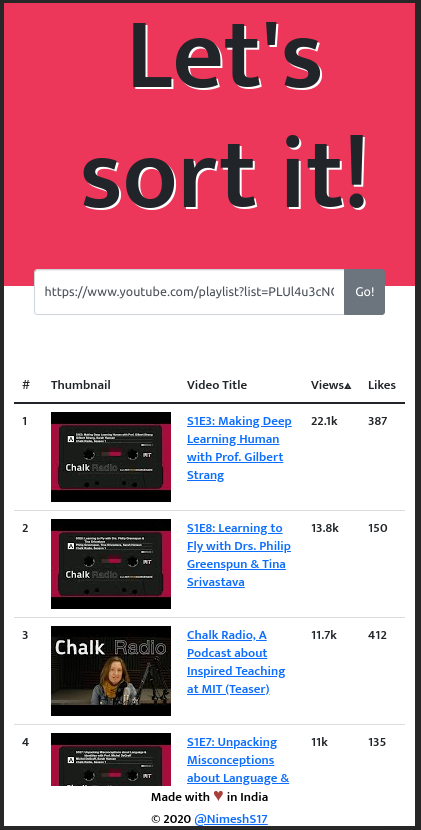

<h1 align="center"> Youtube Playlist Sorter v2 </h1>

## Inspired from [jaydp17/youtube-playlist-sorter](https://github.com/jaydp17/youtube-playlist-sorter)

A Web-app which sorts ↕️ a public playlist based on its popularity 🔥

### 💡 IDEA:

While watching the talks/vidoes of the tech-conferences, have you ever wondered that if you could sort the playlist based on its popularity?

So you can easily pickup that talk up and watch it right away.

There's no such feature on [Youtube](https://youtube.com/) as of now. 

So I thought of building one, on my own.

### Demo

### Screenshots

#### Desktop View

#### Mobile View

## Special Thanks to [Jaydeep Solanki - Brain behind the idea](https://jaydp.com)

## ❤️ Credits

- [Node.js](https://nodejs.org/)
- [React.js](https://reactjs.org/)
- [Netlify](https://www.netlify.com/)

## 🎓 License

[MIT](LICENSE)